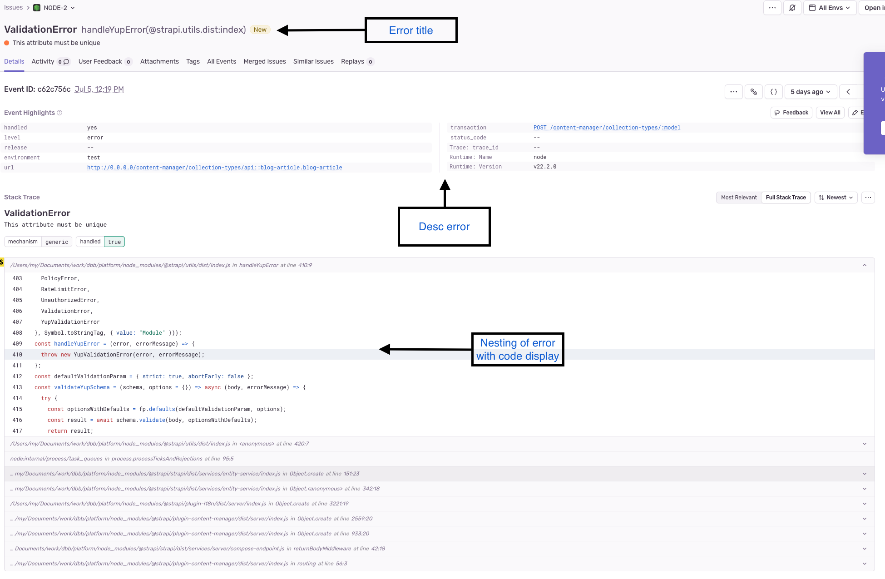

## Name: strapi

## Description

Strapi comes with a full featured [Command Line Interface](https://docs.strapi.io/dev-docs/cli) (CLI) which lets you scaffold and manage your project in seconds.

## Usage

Make a copy of the configured Strapi application and customize it according to your requirements.

### Plugins

The following custom plugins are integrated into the Strapi application. Each plugin enhances the functionality of the pre-built solutions, catering to specific needs.

#### Permissions Manager Plugin

The Permissions Manager plugin for Strapi is designed to manage user roles and permissions more effectively. It works in conjunction with the config-sync plugin to synchronize configurations, ensuring that any role and permission changes are consistently applied across environments.

#### Stripe Payment Plugin

The Stripe Payment plugin for Strapi enables seamless integration with the Stripe payment system. This plugin allows users to create organizations, subscribe to plans, and manage their subscriptions. Additionally, administrators can create and manage products, plans, and subscriptions.

For more details, refer to the README file located at packages/strapi-plugins/<plugin-name>/README.md.

## Examples

### Example GraphQL Query for Multi-Table Search with Pagination:

The example query provided illustrates how to perform a multi-table search using GraphQL in Strapi, incorporating pagination and filtering by specific fields.
This approach grants the client side significant control over filtering, pagination and other operations, making it highly flexible and easily extensible.
To delve into the customization details and parameters involved:
~~~~
query ($query: String, $page: Int, $pageSize: Int) {
  showcases(
    filters: {
      or: [
        { description: { containsi: $query } },
        { title: { containsi: $query } }
      ]
    },
    pagination: {
      page: $page,
      pageSize: $pageSize
    }
  ) {
      data {
        id
        attributes {
          title
          description
        }
      }
  },
  blogArticles(
    filters: {
      or: [
        { description: { containsi: $query } },
        { title: { containsi: $query } }
      ]
    },
    pagination: {
      page: $page,
      pageSize: $pageSize
    }
  ) {
    data {
      id
      attributes {
        title
        description
      }
    }
  }
}
~~~~

### Examples Sentry plugin

The Sentry plugin for Strapi allows you to monitor and track errors in your Strapi application seamlessly. Sentry is a powerful tool for logging and tracking exceptions and errors, providing insights into application performance and stability.

A SENTRY DSN must be obtained in order to operate.  Its help you (https://docs.sentry.io/concepts/key-terms/dsn-explainer/#dsn-utilization)

- `sendMetadata` Whether the plugin should attach additional information (e.g. OS, browser, etc.) to the events sent to Sentry.
- `init` A config object that is passed directly to Sentry during initialization. See the official Sentry documentation for all available options.
- `dsn` Your Sentry data source name.

If necessary, you can customize the Sentry plugin from the Sentry documentation using the "init" key.(https://docs.sentry.io/platforms/javascript/guides/node/configuration/options/)
~~~~ts
sentry: {
    enabled: true,
    config: {
      dsn: env('SENTRY_DSN'),
      sendMetadata: true,
      init:{}
    }
  }
~~~~

## Features

If any form changes are made in the platform, it will be possible to automatically update it in all related systems.

Supports multi-table search using GraphQL, including pagination and filtering by specific fields.
(You can use the built-in capabilities of the @strapi/plugin-graphql)

## Feature Keywords

- strapi-support
- graphql-search
- multi-table-search

## Language and framework

- Node.js
- Strapi
- JavaScript
- TypeScript

## Type

- Application

## Tech Category

- Back-end
- Front-end

## Domain Category

- Common
- admin-panel
- headless-cms

## License

The DBBS Pre-Built Solutions is open-source software licensed under the [MIT License](LICENSE).

## Authors and owners

- asa-dbb
- vks-dbb
- andrii-dbb

## Links

- [Resource center](https://strapi.io/resource-center) - Strapi resource center.
- [Strapi documentation](https://docs.strapi.io) - Official Strapi documentation.
- [Strapi tutorials](https://strapi.io/tutorials) - List of tutorials made by the core team and the community.
- [Changelog](https://strapi.io/changelog) - Find out about the Strapi product updates, new features and general improvements.
- [Strapi GraphQL documentation](https://docs.strapi.io/dev-docs/api/graphql) - Find out about the power of built-in strapi graphql plugin.
- [Strapi Sentry plugin documentation](https://docs.strapi.io/dev-docs/plugins/sentry) - Find out about the configuration of the strapi sentry plugin.
- [Strapi GitHub repository](https://github.com/strapi/strapi)

## External dependencies

- @strapi/*
- react
- react-dom
- styled-components
