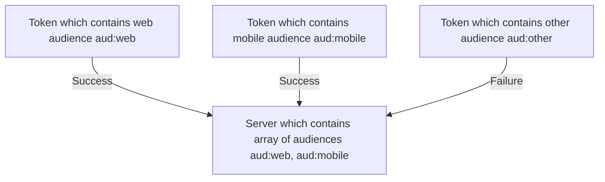

## Name: fast-api-authz

## Description

This authorization module is implemented following the best practices outlined in the Auth0 FastAPI guide. With this module, you can seamlessly integrate authorization functionalities into your FastAPI applications, ensuring robust security measures are in place.

## Usage

Install `fast-api-authz` into your application using poetry.

```bash
poetry add ../../packages/fast-api-modules/authz
```

## Examples

To use fast-api-authz in the FastAPI app import it from packages and provide to router dependencies property.

```ts
#router.py
from fastapi import Security, APIRouter

from src.api import example
from src.settings import settings

from dbbs_fastapi_authz import VerifyToken

api_router = APIRouter()
auth = VerifyToken(settings)
api_router.include_router(example.router, prefix="/examples", tags=["example"], dependencies=[Security(auth.verify, ["test:permission"])])
```

## Audience Claim (aud)

This module uses PyJWT python library to decode token, so main audience logic is described [here](https://github.com/jpadilla/pyjwt/blob/master/docs/usage.rst#audience-claim-aud).
According to Auth0 documentation it does not allow to use multiple audiences in token, so each token will contain only one audience.
Instead of this server can contain several audiences. This module will check if token`s audience is presented in server audiences list

Example


Each error which will be raised during token validation will raise HTTPError with 401 status code

## Permissions
This package uses _permissions_ token`s scope to validate user permissions. 
For access to requested resource user should have all required permission in token.

## Features

The module is implemented according to best practices defined in Auth0 FastAPI guide. 

## Feature Keywords

- auth0-fast-api-adapter

## Language and framework

- Python
- FastAPI

## Type

- Module

## Tech Category

- Back-end

## Domain Category

- Common

## License

The DBBS Pre-Built Solutions is open-source software licensed under the [MIT License](LICENSE).

## Authors and owners

- bilenko-ha1305

## Links

[Auth0 guide for FastAPI](https://auth0.com/blog/build-and-secure-fastapi-server-with-auth0/#Set-Up-an-Auth0-API)

## Relations

- python/apps/fast-api-server

## External dependencies

- pyjwt
- fastapi
